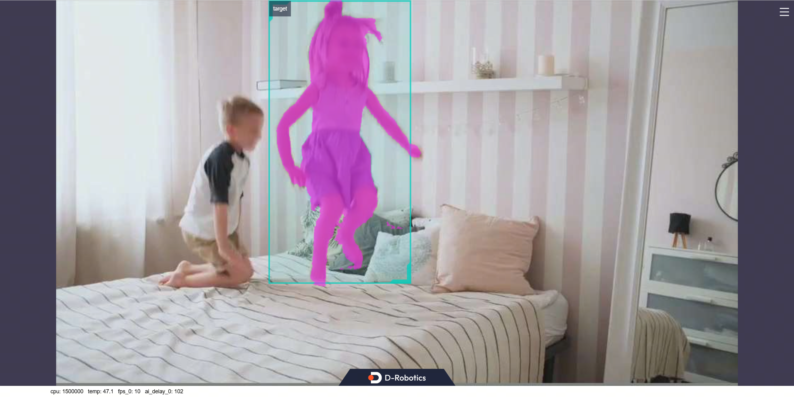

# mono_edgetam

`mono_edgetam` is the quanti model based on [EdgeTAM](https://github.com/facebookresearch/EdgeTAM), which run on RDK platform. It contains two subprojects in the EdgeTAM tracking pipeline:

- `mono_edgetam_prompt`: handles prompt initialization, runs model inference with input images and point prompts, and generates/publishes initialization results.
- `mono_edgetam_track`: handles continuous tracking and segmentation, consumes initialization information, and tracks subsequent frames with result publishing.

## Platform Support Information

- [RDK S100](https://developer.d-robotics.cc/rdks100)

- [RDK S100P](https://developer.d-robotics.cc/rdks100)

## Subproject Overview and Links

### 1) mono_edgetam_prompt

- Directory: `mono_edgetam_prompt/`
- Docs:
  - Chinese: [`mono_edgetam_prompt/README_cn.md`](./mono_edgetam_prompt/README_cn.md)
  - English: [`mono_edgetam_prompt/README.md`](./mono_edgetam_prompt/README.md)
- Role: prompt-initialization stage in the EdgeTAM pipeline, supporting both local-image and subscribed-image modes.

### 2) mono_edgetam_track

- Directory: `mono_edgetam_track/`
- Docs:
  - Chinese: [`mono_edgetam_track/README_cn.md`](./mono_edgetam_track/README_cn.md)
  - English: [`mono_edgetam_track/README.md`](./mono_edgetam_track/README.md)
- Role: continuous tracking-and-segmentation stage in the EdgeTAM pipeline, supporting local-image and subscribed image-stream inference.

## Running Both Subprojects Together (Launch Only)

Recommended launch workflow: start `mono_edgetam_prompt` first, then start `mono_edgetam_track`.

### 1) Terminal A: Launch mono_edgetam_prompt

```bash
source /opt/ros/humble/setup.bash
source ./install/setup.bash

# Download model
wget https://archive.d-robotics.cc/downloads/models/edgetam/s100/model_prompt_to_memory_points.hbm

# Camera source options: mipi / usb / fb
export CAM_TYPE=fb
ros2 launch mono_edgetam_prompt mono_edgetam_prompt.launch.py edgetam_prompt_mode:=0
```

The inference results in the example will be rendered on the web. Enter http://IP:8000 in a browser on your PC to view the image and algorithm rendering results (replace "IP" with the RDK's IP address). Open the settings menu in the upper-right corner of the interface and select the "Full Image Segmentation" option to display the rendering effect.



### 2) Terminal B: Launch mono_edgetam_track

```bash
source /opt/ros/humble/setup.bash
source ./install/setup.bash

# Download model
wget https://archive.d-robotics.cc/downloads/models/edgetam/s100/model_track_step_s7.hbm

# Keep image source consistent with prompt side
export CAM_TYPE=fb
ros2 launch mono_edgetam_track mono_edgetam_track.launch.py edgetam_is_overwrite_features:=0
```

The inference results in the example will be rendered on the web. Enter http://IP:8000 in a browser on your PC to view the image and algorithm rendering results (replace "IP" with the RDK's IP address). Open the settings menu in the upper-right corner of the interface and select the "Full Image Segmentation" option to display the rendering effect.

