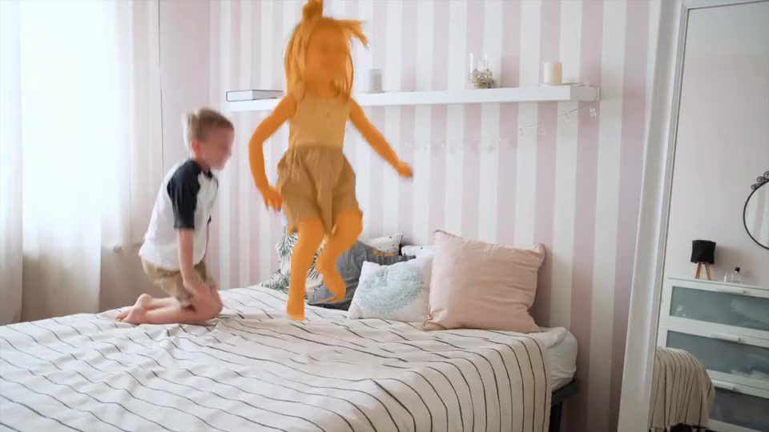

English | [简体中文](./README_cn.md)

# Feature Introduction

`mono_edgetam_prompt` is the **prompt-initialization** stage in the EdgeTAM tracking pipeline. It performs prompt-model inference based on an input image and point prompts (coordinates and labels), writes memory-related tensors to **binary files** for downstream use, and when `feed_type=1`, it also **subscribes to image data and upstream detection AI messages** to update prompt points, while **publishing** segmentation and target ROI results via `ai_msgs`.

In short: **run `mono_edgetam_prompt` first to generate prompt/memory initialization outputs, then pass them to `mono_edgetam_track` for continuous tracking.**

# Development Environment

- Programming language: C/C++
- Development platform: S100
- System version: Ubuntu 22.04
- Compiler toolchain: GCC 11.4.0

# Build

## Dependencies

- OpenCV: 4.x

ROS packages:

- rclcpp
- dnn_node
- ai_msgs
- sensor_msgs
- hbm_img_msgs
- hobot_cv

## Build Options

1. Platform options

- `-DPLATFORM_S100=ON`: build for RDK S100.
- If neither is specified, S100 is used by default.

2. Shared-memory option

- Shared-memory subscription support is enabled by default (`SHARED_MEM_ENABLED`).
- Shared-memory mode depends on `hbm_img_msgs` and corresponding runtime components.

## Build on Ubuntu

```shell
colcon build --packages-select mono_edgetam_prompt
```

## Docker cross-compilation

1. Verify the build environment

- Build inside Docker, and ensure TogetherROS is installed in the container. For Docker setup, cross-compilation instructions, and TogetherROS build/deployment instructions, refer to `README.md` in the `robot_dev_config` repository.
- `dnn_node` package has been built.
- `hbm_img_msgs` package has been built (see the Dependency section for build method).

2. Build

- Build command:

  ```shell
  # RDK S100
  bash robot_dev_config/build.sh -p S100 -s mono_edgetam_prompt
  ```

- Shared-memory communication is enabled by default in the build options.

# Usage

## Dependencies

- `mipi_cam` / `hobot_usb_cam` / `hobot_image_publisher`: image source
- `hobot_codec`: codec bridge (used in launch to connect shared-memory and ROS image topics)
- `hobot_shm`: shared-memory runtime environment
- `websocket`: visualization for image and AI messages

## Parameters

Parameter names are consistent with `declare_parameter` in `mono_edgetam_prompt_node.cpp`.

| Parameter | Description | Required | Type | Default |
| --- | --- | --- | --- | --- |
| `feed_type` | Input mode: `0` local image, `1` subscribed image (with AI subscribe/publish) | No | int | `0` |
| `is_sync_mode` | DnnNode inference mode: `0` async (thread pool), `1` sync (same-thread `RunImpl`) | No | int | `0` |
| `is_shared_mem_sub` | When `feed_type=1`: `1` subscribe shared-memory image, `0` subscribe `sensor_msgs/Image` | No | int | `0` |
| `prompt_mode` | Point-prompt preset: `0` box-style labels (`2`/`3`) with default coordinates; `1` point-style label `1` with another coordinate set | No | int | `0` |
| `dump_render_img` | When `feed_type=0` and enabled: save rendered image `render.jpeg` in the current working directory | No | int | `0` |
| `model_file_name` | Prompt model (`.hbm`) path | No | string | `model_prompt_to_memory_points.hbm` |
| `dump_mem_feat_path` | File path for writing memory-feature tensor after inference | No | string | `cond_maskmem_features.bin` |
| `dump_mem_ptr_path` | File path for writing memory-pointer tensor after inference | No | string | `cond_obj_ptr.bin` |
| `image` | Local image path when `feed_type=0` | No | string | `bedroom/00000.jpg` |
| `ros_img_topic_name` | ROS image topic when `feed_type=1` and `is_shared_mem_sub=0` | No | string | `/image_raw` |
| `ai_msg_pub_topic_name` | Topic for publishing `ai_msgs/PerceptionTargets` (segmentation + target) when `feed_type=1` | No | string | `/perception/segmentation/edgetam` |
| `ai_msg_sub_topic_name` | Topic for subscribing upstream detections (`ai_msgs/PerceptionTargets`) to update point prompts when `feed_type=1` | No | string | `/hobot_dnn_detection` |
| `sharedmem_img_topic_name` | Shared-memory image topic when `is_shared_mem_sub=1` (requires `SHARED_MEM_ENABLED`) | No | string | `/hbmem_img` |

## Running

### Run executable directly

```shell
source /opt/ros/humble/setup.bash
source ./install/setup.bash

# Copy according to actual install path
wget https://archive.d-robotics.cc/downloads/models/edgetam/s100/model_prompt_to_memory_points.hbm
wget https://archive.d-robotics.cc/downloads/models/edgetam/bedroom.tar
tar -xvf bedroom.tar

# Mode 1: Run with local image
ros2 run mono_edgetam_prompt mono_edgetam_prompt --ros-args -p feed_type:=0 -p image:=bedroom/00000.jpg -p image_type:=0 -p dump_render_img:=1

# Mode 2: shared-memory subscribed image inference. At the same time, send a ai topic (topic name: /hobot_dnn_detection) in another window to change the detection box.
ros2 run mono_edgetam_prompt mono_edgetam_prompt --ros-args -p feed_type:=1 --ros-args --log-level warn -p prompt_mode:=0 -p ai_msg_sub_topic_name:="/hobot_dnn_detection"

ros2 topic pub /hobot_dnn_detection ai_msgs/msg/PerceptionTargets '{"targets": [{"rois": [{"rect": {"x_offset": 240, "y_offset": 135, "width": 480, "height": 270}, "type": "anything"}]}] }'

# Mode 3: shared-memory subscribed image inference. At the same time, send a ai topic (topic name: /hobot_dnn_detection) in another window to change the prompt points.
ros2 run mono_edgetam_prompt mono_edgetam_prompt --ros-args -p feed_type:=1 --ros-args --log-level warn -p prompt_mode:=0 -p ai_msg_sub_topic_name:="/hobot_dnn_detection"

ros2 topic pub /hobot_dnn_detection ai_msgs/msg/PerceptionTargets '{"targets": [{"rois": [{"rect": {"x_offset": 210, "y_offset": 350, "width": 0, "height": 0}, "type": "anything"}, {"rect": {"x_offset": 250, "y_offset": 220, "width": 0, "height": 0}, "type": "anything"}]}] }'
```

### Launch with launch file (recommended)

```shell
source /opt/ros/humble/setup.bash
source ./install/setup.bash

# Copy according to actual install path
wget https://archive.d-robotics.cc/downloads/models/edgetam/s100/model_prompt_to_memory_points.hbm
wget https://archive.d-robotics.cc/downloads/models/edgetam/bedroom.tar
tar -xvf bedroom.tar

# export CAM_TYPE=mipi/usb/fb
export CAM_TYPE=fb
ros2 launch mono_edgetam_prompt mono_edgetam_prompt.launch.py edgetam_prompt_mode:=0
```

## Launch Arguments

Consistent with declarations in `mono_edgetam_prompt.launch.py`.

| Parameter | Description | Default |
| --- | --- | --- |
| `edgetam_image_width` | Image width of camera/replay publisher node | `960` |
| `edgetam_image_height` | Image height of camera/replay publisher node | `540` |
| `edgetam_msg_pub_topic_name` | Passed to node parameter `ai_msg_pub_topic_name` and used as websocket intelligent-result topic | `/perception/segmentation/edgetam` |
| `edgetam_prompt_mode` | Mapped to node parameter `prompt_mode` | `0` |
| `device` | Camera device (USB: `/dev/video0`, MIPI: `F37`, etc.) | Platform default in launch |
| `publish_image_source` | Image path for `CAM_TYPE=fb` | `bedroom/00000.jpg` |

**Pipeline summary:** MIPI/replay: camera -> shared memory -> `hobot_codec` encode (for example, `/hbmem_img` -> `/image`) -> node.  
USB: follows a separate NV12 encode/decode branch defined in the launch file.

# Integration with mono_edgetam_track

- Run `mono_edgetam_prompt` first (local mode writes binary files at paths specified by `dump_mem_*`; align them with `mono_edgetam_track` input paths).
- Then run `mono_edgetam_track` for continuous tracking.
- Keep image source, resolution, and topic configuration consistent across both packages.

# Result Analysis

## RDK Result Display

Log:

Run command:
`ros2 run mono_edgetam_prompt mono_edgetam_prompt --ros-args -p feed_type:=0 -p dump_render_img:=1`

```shell
[UCP]: log level = 3
[UCP]: UCP version = 3.13.6
[VP]: log level = 3
[DNN]: log level = 3
[HPL]: log level = 3
[UCPT]: log level = 6
[WARN] [1776415725.063074658] [mono_edgetam_prompt]: mono_edgetam_prompt params:
 feed_type(0:local, 1:sub): 0
 image: bedroom/00000.jpg
 is_sync_mode: 0
 is_shared_mem_sub: 0
 prompt_mode: 0
 ros_img_topic_name: /image_raw
 ai_msg_pub_topic_name: /perception/segmentation/edgetam
 ai_msg_sub_topic_name: /hobot_dnn_detection
 model_file_name: model_prompt_to_memory_points.hbm
 dump_mem_feat_path: cond_maskmem_features.bin
 dump_mem_ptr_path: cond_obj_ptr.bin
 dump_render_img: 1
[INFO] [1776415725.063383821] [dnn]: Node init.
[INFO] [1776415725.063433173] [dnn]: Model init.
[BPU][[BPU_MONITOR]][281473663143968][INFO]BPULib verison(2, 2, 15)[f21ee84]!
[DNN]: 3.13.6_(4.7.5 HBRT)
[INFO] [1776415726.648634111] [dnn]: The model input 0 width is 1 and height is 1024
[INFO] [1776415726.648696689] [dnn]: The model input 1 width is 2 and height is 512
[INFO] [1776415726.648720040] [dnn]: The model input 2 width is 0 and height is 2
[INFO] [1776415726.648733791] [dnn]: The model input 3 width is 0 and height is 0
[INFO] [1776415726.648820119] [dnn]:
Model Info:
name: model_prompt_to_memory_points.
[input]
 - (0) Layout: NONE, Shape: [1, 1024, 1024, 1], Type: HB_DNN_TENSOR_TYPE_U8.
 - (1) Layout: NONE, Shape: [1, 512, 512, 2], Type: HB_DNN_TENSOR_TYPE_U8.
 - (2) Layout: NONE, Shape: [1, 2, 2, 0], Type: HB_DNN_TENSOR_TYPE_S32.
 - (3) Layout: NONE, Shape: [1, 2, 0, 0], Type: HB_DNN_TENSOR_TYPE_S32.
[output]
 - (0) Layout: NONE, Shape: [1, 1, 256, 256], Type: HB_DNN_TENSOR_TYPE_F32.
 - (1) Layout: NONE, Shape: [1, 512, 64, 0], Type: HB_DNN_TENSOR_TYPE_F32.
 - (2) Layout: NONE, Shape: [1, 256, 0, 0], Type: HB_DNN_TENSOR_TYPE_F32.

[INFO] [1776415726.648874196] [dnn]: Task init.
[INFO] [1776415726.650730222] [dnn]: Set task_num [4]
[WARN] [1776415726.650790725] [mono_edgetam_prompt]: Model name: model_prompt_to_memory_points
[WARN] [1776415726.788639263] [mono_edgetam_prompt]: Save Render Image: render.jpeg
```

## Rendered Result


